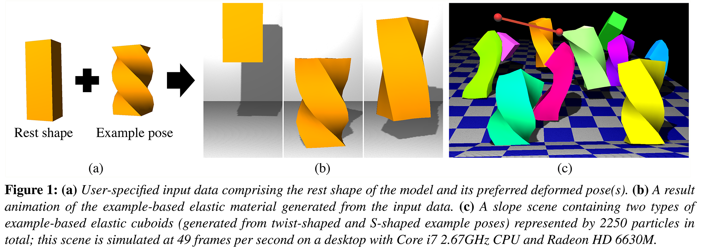

## !!! Important Notice !!!

This repository has not been maintained for a long time and should have many build & runtime issues with recent environments. Unfortunately, I do not have enough time to update this repository for now. Please understand that this repository is just for the record purpose.

Please also note that most of the source codes were written by an undergrad student who had almost no experience in C++ and 3D graphics at the time. The source codes are quite unreadable and unreasonable.

---

## Real-Time Example-Based Elastic Deformation (SCA 2012)

This repository provides an implementation of the paper:

> Yuki Koyama, Kenshi Takayama, Nobuyuki Umetani, and Takeo Igarashi. 2012. Real-time example-based elastic deformation. In Proceedings of the ACM SIGGRAPH/Eurographics Symposium on Computer Animation (SCA '12). Eurographics Association, Aire-la-Ville, Switzerland, Switzerland, 19-24.



## Developers

The original app was implemented by Kenshi Takayama and Yuki Koyama, and is currently maintained by Yuki Koyama.

[koyama@is.s.u-tokyo.ac.jp](mailto:koyama@is.s.u-tokyo.ac.jp)

## Project Page

[https://koyama.xyz/project/ExampleBasedShapeMatching/](https://koyama.xyz/project/ExampleBasedShapeMatching/)

## Notes

- The source codes (except for the third party ones under `include`, `lib`, and `external`) are licensed under GPLv3 License; see `LICENSE`.
- This implementation is slightly modified from the version of making the demos and recording the timings for the paper.
- It is not widely tested.
- It is written only for macOS. Other environments are not supported.
- If you want to build and use it on other environments, please achieve it by yourself. (PR is welcomed)

## Third Parties

- Eigen (`brew install eigen`; tested with v3.3.7)
- OpenMesh (`brew install open-mesh`; tested with v8.1)
- tetgen (v1.5.1 is included as a git submodule)
- tinyxml (directly included)
- AntTweakBar (directly included)
- GLEW (directly included)
- OpenGL (`-framework OpenGL`)
- GLUT (`-framework GLUT`)

## Build and Run (macOS)

Before building the app, OpenMesh and Eigen need to be install:
```
brew install open-mesh eigen
```
Then, the app can be built using CMake on macOS by
```
mkdir build
cd build
cmake ../
make
```
Then, run the app by
```
./app
```

## How to Use

Please see this example of use:

[http://www.youtube.com/watch?v=7Pe-RPLMeDI](http://www.youtube.com/watch?v=7Pe-RPLMeDI)

If you want to learn more, please read the source codes.
